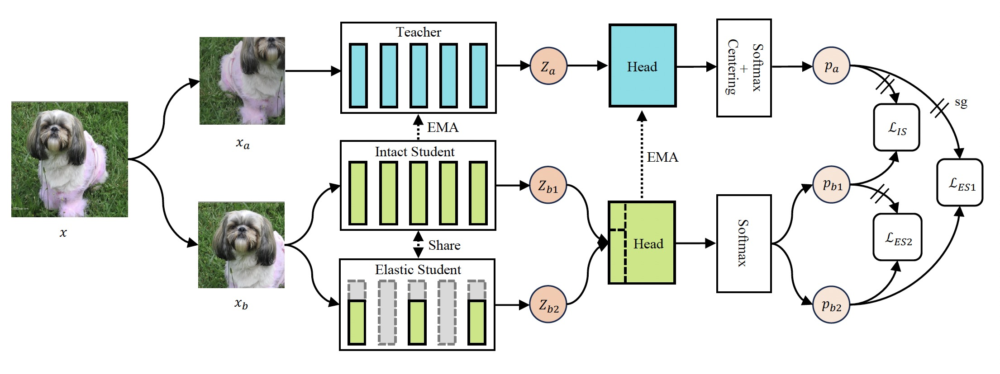

# POA: Pre-training Once for Models of All Sizes

This is the official implementation for ECCV24 paper: "POA: Pre-training Once for Models of All Sizes"

<div align="center">
  
</div>
POA is a novel self-supervised pre-training framework capable of training multiple-sized models concurrently. By choosing different elastic widths and depths, the pre-trained teacher model can generate a sufficient number of candidate sub-networks for the selection of the suitable model tailored for downstream applications according to the computational resources available.

## Environment preparation

This code uses the same environment as dinov2, please refer to:[https://github.com/facebookresearch/dinov2](https://github.com/facebookresearch/dinov2)

## Data preparation for pretraining

The root directory of the Imagenet dataset should hold the following contents:
- `<ROOT>/train/n01440764/n01440764_10026.JPEG`
- `<ROOT>/train/[...]`
- `<ROOT>/train/n15075141/n15075141_9993.JPEG`
- `<ROOT>/val/n01440764/ILSVRC2012_val_00000293.JPEG`
- `<ROOT>/val/[...]`
- `<ROOT>/val/n15075141/ILSVRC2012_val_00049174.JPEG`
- `<ROOT>/labels.txt`

The provided dataset implementation expects a few additional metadata files and these metadata files can be generated (once) with the following lines of Python code:

```python
from poa.data.datasets import ImageNet

for split in ImageNet.Split:
    dataset = ImageNet(split=split, root="<ROOT>", extra="<EXTRA>")
    dataset.dump_extra()
```

## POA pretraining

Run [run_pretrain.sh](shells/run_pretrain.sh) for POA pretraining on 4 A100-80GB nodes (32 GPUs) :

```shell
sh shells/run_pretrain.sh 
```

## Evaluation of pretrained models

k-NN, linear probing, and fine-tuning eval:
```shell
sh shells/eval/eval_knn.sh 
sh shells/eval/eval_linear.sh 
sh shells/eval/eval_finetuning.sh 
```
For downstream task evaluation, please run [extract_elastic.sh](shells/extract_elastic.sh) to extract the specific submodel. After that, run the corresponding scripts in the [shell/eval](shell/eval) folder.

## Acknowledgement

This repository is built based on the [dinov2](https://github.com/facebookresearch/dinov2) repository and the [ibot](https://github.com/bytedance/ibot) repository.

## License

POA code is released under the Apache License 2.0. See [LICENSE](LICENSE) for additional details.

